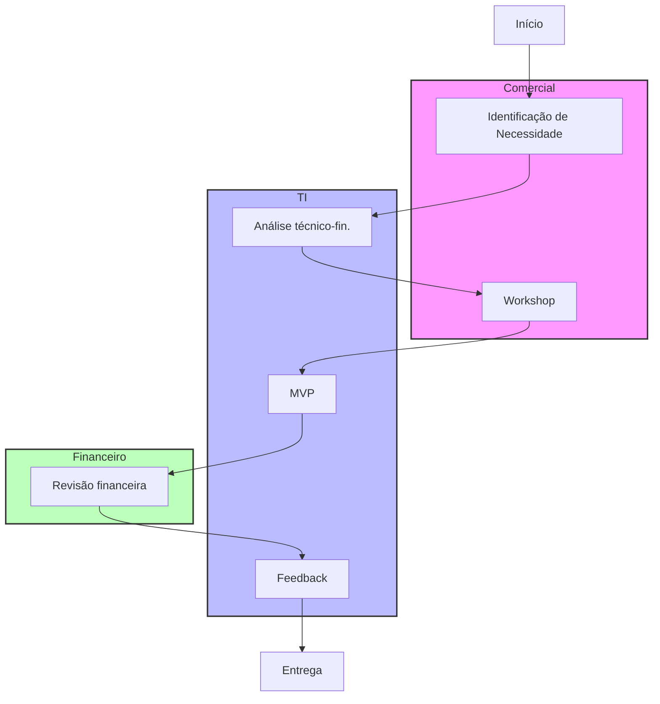
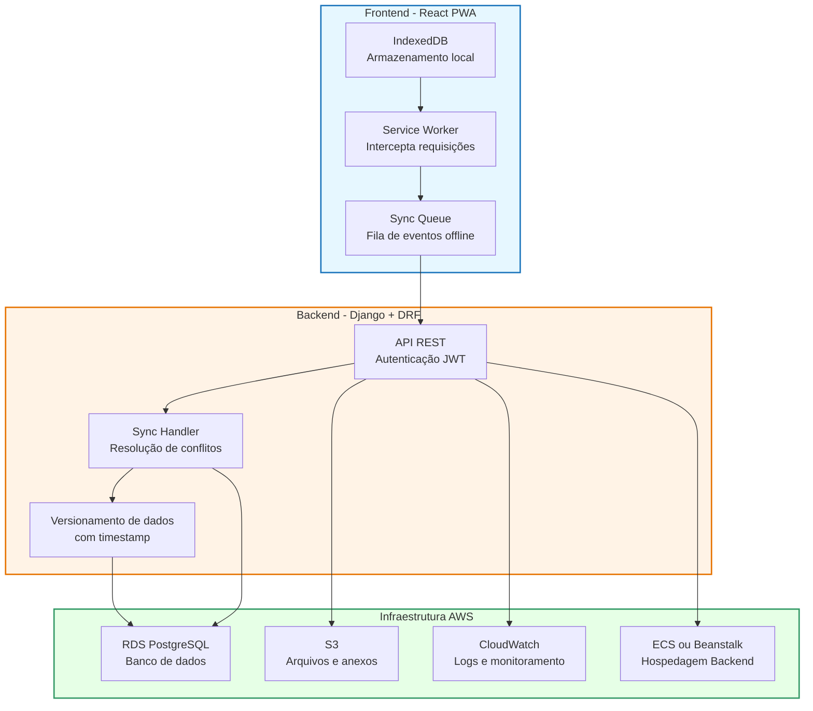
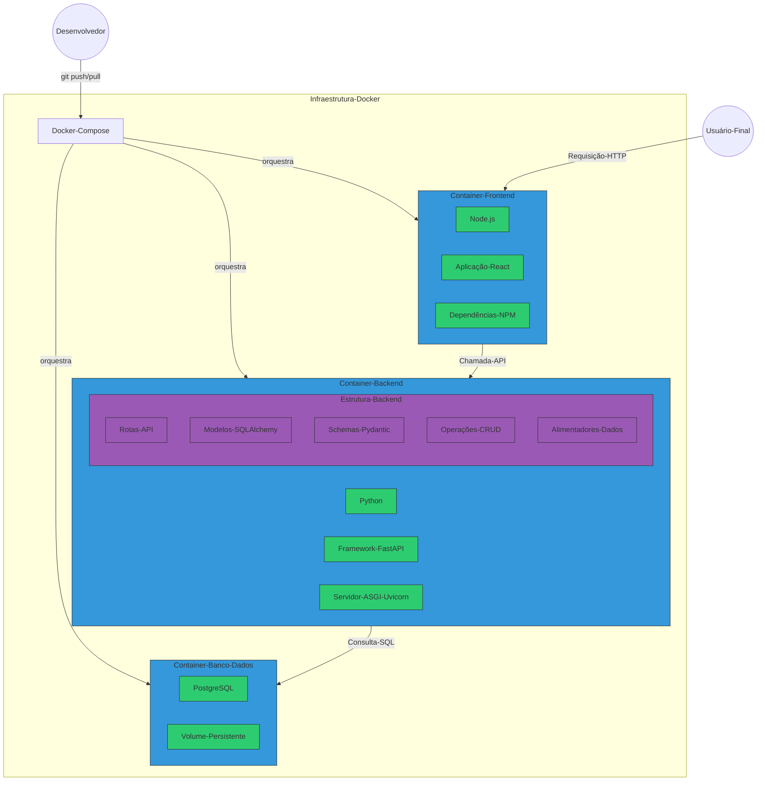

# Avaliação Técnica - Tech Lead

---

## Parte 1: Desafio de Contexto Ambíguo

### Quais os 3 primeiros passos concretos que você faria na primeira semana?
Antes de tudo, é essencial entender a origem da frustração das áreas em relação à TI. Precisamos rapidamente responder:

- Por que o time de BI entrega dashboards atrasados?
- Por que o sistema de cotação não está sendo utilizado?
- Quais são os reais motivos das reclamações sobre os altos custos de TI?

Para resolver esses problemas de forma assertiva e imediata, proponho os três passos iniciais a seguir:
1. **Reunião individual com as áreas (TI, Comercial e Financeiro)**
   *Objetivo:* Escutar ativamente e entender profundamente as necessidades, expectativas e principais frustrações de cada equipe. Este primeiro contato ajuda a estabelecer empatia, reconquistar a confiança das áreas no time de TI, e compreender claramente os objetivos que serão alcançados em curto prazo. Sem confiança, nenhuma solução tecnológica terá adoção real.

2. **Diagnóstico rápido e análise das ferramentas atuais (dashboards, sistema de cotação, infraestrutura e etc)**
   *Objetivo:* Investigar os principais gargalos técnicos, de desempenho e usabilidade que causam atrasos e baixa adoção. O foco será identificar problemas críticos e oportunidades que possam ser resolvidas rapidamente, garantindo visibilidade imediata dos resultados ao restante da empresa.

3. **Definição de Quick Wins**
   *Objetivo:* Realizar pequenas melhorias rápidas, visíveis e de alto impacto que demonstram resultados concretos em pouco tempo. Exemplos práticos podem incluir otimizações no dashboard para redução de tempo de carregamento ou pequenas mudanças de usabilidade que aumentem significativamente a adoção do sistema de cotação. Esses resultados rápidos são essenciais para aumentar a credibilidade da TI perante as demais áreas e criar uma base sólida para projetos futuros

---

### Como você engajaria o comercial para cocriar uma solução digital?

1. **Escuta ativa**: Realizar reuniões abertas para entender claramente as necessidades, dificuldades reais e expectativas do time comercial. Este é um momento chave para identificar exatamente o que é valioso para eles.
2. **Criação de POC**: Prova de conceito para a solução.
3. **Protótipo rápido (MVP)**: Entregar rapidamente uma versão simplificada e testável da solução, validada diretamente pelo comercial, para assegurar que a solução atenda às suas reais expectativas.
4. **Feedback contínuo**: Implementar ciclos curtos (semanais ou quinzenais) de validação e ajustes com participação ativa do comercial, reforçando o sentimento de propriedade sobre a solução
5. **Celebração dos resultados iniciais**: Apresentar resultados concretos rapidamente à liderança comercial, consolidando o apoio interno e fortalecendo a parceria estratégica entre TI e Comercial

---
### Fluxo ideal entre as áreas para construção de uma solução digital

> O fluxograma foi feito usando Mermaid diretamente no Markdown para tornar o processo mais simples e evitar o uso de imagens externas.

---
### Com um Dashboard urgente e um sistema a reescrever, o que você prioriza e por quê?

Priorizo o **Dashboard urgente** pela importância imediata nas decisões de negócio e recuperação rápida da confiança da TI perante as outras áreas. Reescrever um sistema é algo muito custoso e requer tempo, coisa que não teriamos nesses 60 dias

---

### Narre uma situação real em que houve conflito entre a TI e o negócio. Como você atuou?

No Seguros Promo, onde atuo atualmente, houve um conflito entre o time de tecnologia e a área de negócios relacionado à criação de uma nova safearea — uma área do cliente que permitiria visualizar e gerenciar apólices, emitir novas, cancelar, enviar e-mails e adicionar segurados.

A área de negócio pressionava por múltiplas entregas simultâneas, alegando que o sistema era essencial para melhorar a eficiência dos times de operação e emissão. Por outro lado, o time técnico alertava sobre os riscos de sobrecarga, baixa qualidade e atrasos nas entregas caso tudo fosse feito de uma vez

Como Tech Lead, atuei como ponte entre os dois lados. Facilitei reuniões com ambas as equipes para entender melhor as prioridades reais e alinhar expectativas. Propus uma abordagem de entregas contínuas e incrementais, priorizando as funcionalidades de maior impacto imediato, garantindo qualidade e evitando retrabalho.

Essa mediação funcionou: o time técnico pôde trabalhar com foco e qualidade, enquanto o time de negócios teve entregas previsíveis e com valor real desde os primeiros ciclos. Hoje, a safearea consolidou-se como um dos pilares da plataforma, com mais de 2000 acessos únicos diários, e serve tanto agências quanto clientes finais.

Essa experiência reforçou a importância da comunicação ativa, do alinhamento constante e de uma liderança que busca consenso sem abrir mão da sustentabilidade técnica.

---

## Parte 2: Escolhas Difíceis em Arquitetura Técnica

### Descrição da arquitetura completa

A proposta é utilizar uma arquitetura offline-first, aproveitando a stack atual da empresa (Django + PostgreSQL + React), que é amplamente adotada no mercado, o que facilita a manutenção e onboarding de novos desenvolvedores

* **Backend**: Django com PostgreSQL. O django seria responsável por servir dados e receber sincronizações do frontend. Aqui, poderiamos utilizar DRF, com JWT para auth e last-write-wins para garantir sincronização. A depender dos dados que devemos sincronizar e a necessidade real de negócio, teriamos que ter estratégias mais robustas de sistemas distribuidos, mas, para um primeiro sistema, isso seria o suficiente.
* **Frontend**: Pwa para uso offline via navegador. Vamos utilizar também indexedDB para utilizar no navegador para armazenar localmente os dados.

* **Infraestrutura**: Para a infra, podemos utilizar AWS/GCP (a depender do que a própria empresa utiliza) e aplicar IAC nos deploys.

---

### Quais os maiores trade-offs dessa solução? Como você os avaliaria?

Ao adotar uma arquitetura **offline-first** com PWA, IndexedDB e sincronização automática, alguns trade-offs importantes precisam ser considerados:

#### 1. Complexidade na sincronização de dados
- **Descrição:** A sincronização entre dados locais (IndexedDB) e o backend pode gerar conflitos e inconsistências se não for bem planejada.
- **Avaliação:** Iniciamos com uma estratégia simples (last-write-wins), mas deixamos espaço para evoluir para versionamento de registros ou logs de eventos caso o sistema se torne mais crítico. Priorizamos o ganho rápido com menor complexidade

#### 2. Maior esforço no frontend
- **Descrição:** O frontend terá que lidar com lógica de cache, fila de eventos offline, controle de estado e resolução de sincronização.
- **Avaliação:** Compensamos essa complexidade investindo em boas práticas de desenvolvimento (useContext, Service Workers bem definidos e separação clara entre dados locais e sincronizados). O ganho de usabilidade para vendedores no campo justifica esse esforço, onde internet não é garantia

#### 3. Latência percebida na atualização de dados
- **Descrição:** A sincronização assíncrona pode gerar delay entre a ação do usuário e a confirmação real no backend.
- **Avaliação:** Comunicamos claramente ao usuário quando ele está offline ou em modo “não sincronizado”. Garantimos que ações locais tenham efeito imediato no app, mesmo que a sincronização ocorra depois.

#### 4. Dependência do navegador e IndexedDB
- **Descrição:** IndexedDB tem diferenças sutis entre navegadores e limitações (ex: cota de armazenamento, APIs inconsistentes).
- **Avaliação:** Escolhemos IndexedDB por ser a melhor solução disponível no navegador para persistência estruturada. Usamos bibliotecas maduras como idb para abstrair inconsistências e facilitar testes

#### 5. Custo técnico da escalabilidade
- **Descrição:** Com o crescimento do uso (ex: 1000 usuários), será necessário escalar o backend e otimizar queries, fila de eventos e cache.
- **Avaliação:** Utilizamos serviços gerenciados da AWS com escalabilidade automática (RDS, ECS, etc.), além de pensar desde o início na separação por regiões e filtros para reduzir carga no banco

---

### E se sua equipe tivesse apenas 1 backend júnior e 1 frontend pleno?

Reduziria o escopo inicial para funcionalidades essenciais, priorizando a usabilidade offline e a sincronização básica de dados. O objetivo seria garantir entregas consistentes e com qualidade, evitando sobrecarga na equipe.

A primeira versão do sistema focaria em permitir que os vendedores consigam consultar dados locais e registrar propostas offline, com sincronização automática simples ao restabelecer conexão.

Funcionalidades mais complexas, como filtros avançados, histórico detalhado ou gerenciamento completo de propostas, seriam adicionadas em versões futuras, de forma incremental e validada com o time comercial

---

### Quando usar SQLite, IndexedDB ou outro armazenamento local?

* **SQLite**: Apps móveis robustos.
* **IndexedDB**: Aplicações Web offline (PWAs).
* **LocalStorage**: Pequenas quantidades de dados não críticos.

Para esta aplicação, **IndexedDB** é a melhor opção.

---

### Diagrama da solução proposta

> Novamente, usei mermaidchart para facilitar o desenho da solução.
---

## Parte 3: Gestão de Pessoas e Cultura

### Situação real recuperando motivação de colaborador

Identifiquei um colaborador desmotivado por falta de reconhecimento e sem desafio técnicos adequados. Realizeis reuniões 1:1, reconhecendo publicamente suas contribuições importantes e atribuindo para ele demandas mais tecnicas para mostrar a confiança que temos nele. Em pouco tempo ele recuperou seu ânimo e voltou a contribuir ativamente com resultados animadores 

---

### Definição de maturidade e critérios para promoção
Considero um desenvolvedor maduro aquele que demonstra:
* **Qualidade e autonomia técnica**: Capacidade de resolver problemas complexos deforma independente e com qualidade
* **Comunicação e trabalho em equipe**: Interage positivamente com colegas e em todos os ritos
* **Proatividade e aprendizado contínuo**: Busca continua por crescimento técnico, assumindo responsabilidades maiores espontaneamente

---

### Como atuar com Joana (muito técnica, mas não escuta) e Carlos (bom comunicador, mas inseguro)?

* **Joana**: Realizaria reuniões individuais regulares, focando em exemplos concretos onde escutar teria melhorado o resultado. 
* **Carlos**: Trabalharia com ele em pequenas tarefas técnicas crescentes, fornecendo feedback positivo constante e suporte técnico próximo para aumentar sua confiança gradualmente.

---

### Um dev declara burnout e quer sair em uma semana. Qual sua ação imediata?

A primeira ação é acolher com escuta ativa e respeito. Em casos de burnout, o papel da liderança não é resolver, mas **oferecer suporte institucional e humano**. Minhas ações seriam:

1. **Conduzir uma conversa individual empática e sem julgamento**, reforçando que a saúde do colaborador é prioridade.
2. **Encaminhar a situação imediatamente para o RH**, garantindo que a empresa ofereça o suporte necessário (psicoterapia, licença médica, plano de retorno).
3. **Reavaliar com o time as demandas, prazos e ritmo de entregas**, buscando eliminar ou mitigar a raiz do problema que causou a sobrecarga.
4. **Trabalhar com o RH na construção de um plano de afastamento e possível retorno saudável**, se for da vontade do colaborador.
5. **Reforçar uma cultura preventiva**, com rituais que ajudem a identificar sinais de esgotamento antes que se agravem (1:1 frequentes, acompanhamento de carga de trabalho, pesquisa de clima).

É claro que, cada caso é um caso, e ações específicas devem ser tratadas de acordocom cada colaborador

---

### Construção de cultura de feedback contínuo

* **1:1 semanais** com cada membro do time para feedback individualizado e acompanhamento próximo.
* **Retrospectivas quinzenais** abertas e transparentes,promovendo discussões transparentes sobre melhorias técnicas e comportamentais
* **Canais de comunicação abertos** (ex. Slack) para feedback rápido, incentivando uma cultura de abertura constante e sem barreiras.

---

## Parte 4: Estratégia e Métricas de Sucesso

### Crie um OKR completo para um time responsável por um sistema de precificação.

**Objetivo:** Aumentar a competitividade comercial e a eficiência operacional por meio de um sistema de precificação inteligente, confiável e ágil/

**Resultados-chave:**
- Reduzir o tempo médio de atualização de preços em 60% nos próximos 3 meses
- Elevar a acurácia da precificação em 80%, alinhando valores aos dados de mercado em tempo real
- Alcançar 90% de adoção interna da nova ferramenta de precificação entre os times comerciais e operacionais
- Aumentar em 15% a margem de contribuição média nas vendas realizadas com apoio do novo sistema

---

### Quais métricas você usaria para medir a efetividade técnica da equipe? E o impacto no negócio?

**Efetividade técnica:**
- Tempo médio entre concepção e entrega de funcionalidades (lead time)
- Cobertura de testes automatizados por módulo
- Taxa de retrabalho ou bugs em produção
- Nível de aderência a padrões arquiteturais definidos (ex: cobertura de observabilidade, segurança, testes e etc)
- Tempo médio de resposta a incidentes críticos MTTR

**Impacto no negócio:**
- % de vendas com apoio direto do sistema de precificação
- Aumento médio da margem de contribuição por negociação
- Redução do tempo de resposta a solicitações de orçamento
- NPS dos usuários internos da ferramenta (comercial, pricing, operação)
- Volume de alterações manuais evitadas por recomendações automáticas do sistema

### Diretoria quer cortar investimento. Como demonstrar valor?

Demonstro valor de forma objetiva, conectando tecnologia com resultado tangível para o negócio. As entregas da área de tecnologia devem estar sempre associadas a:

- **ROI claro:** Exemplo: para cada R$ 1 investido em tecnologia no último trimestre, obtivemos Rs 3,20 em economia operacional ou receita incremental
- **Eficiência operacional:** Reduções em horas de retrabalho, automações implantadas, tempo economizado por colaborador
- **Aumento de margem:** Impactos positivos diretos nos KPIs financeiros da área comercial e de supply chain
- **Dados de adoção:** % de uso das soluções entregues e feedback positivo de usuários estratégicos

Também trago benchmarks e indicadores de mercado que sustentem o papel estratégico da tecnologia em empresas de alta performance. Além de utilizar dados gerados por nosso sistema para concretizar a necessidade do time de tecnologia.

---

### Apenas um slide para o CEO
O slide precisaria de ter informações importantes para o CEO, como ROI das soluções, redução de custos, crescimento de produtividade e etc. Se fosse para ter um slide, colocaria dessa forma com dados objetivos:
* **ROI das soluções** (ex: economia de RS X e receita incremental de RS Y)
* **Gráfico de impacto nas operações** (Ex, redução de tempo, aumento de margem e etc)
* **Resumo executivo com frase de impacto** (Ex: em 3 meses entregamos tecnologia que economizou 500 horas de operação e aumentou em 15% a margem líquida)

---

### Decisão estratégica impopular e aprendizados

No Seguros Promo, atuávamos com uma versão bastante desatualizada do Django (v1.11.17), o que comprometia tanto a segurança da aplicação quanto a produtividade do time técnico, que estava limitado pelas restrições da versão antiga.

Tomei a decisão estratégica de priorizar a atualização completa do sistema para uma versão moderna, mesmo sabendo que isso exigiria pausar as entregas de demandas de negócio por cerca de 3 semanas.

Durante esse período, mantive diálogos diários com os times de negócio e operação, explicando a necessidade técnica, os riscos envolvidos na manutenção da versão obsoleta, e os ganhos futuros com a atualização — como segurança, performance e acesso a novas funcionalidades da framework.

Apesar do desconforto momentâneo pela pausa nas entregas, a decisão se mostrou acertada: mitigamos vulnerabilidades críticas, liberamos recursos técnicos modernos para o time de desenvolvimento e melhoramos significativamente a qualidade e o tempo das próximas entregas.

**Aprendizado:** decisões impopulares, quando bem fundamentadas e comunicadas com transparência, constroem confiança e mostram liderança técnica. É fundamental manter um canal de diálogo aberto com o negócio, mostrando que a “não entrega” momentânea pode ser o maior investimento em sustentabilidade do produto.

---

## Parte 5: Entrega artefato técnico

O desenho da arquitetura é a seguir, também criada com mermaidchart. É possivel copiar o código dentro do arquivo `resposta.md`

O teste técnico será enviado num .zip para facilitar a entrega, onde todos os arquivos que foram criados estarão disponíveis. e para rodar o projeto basta descompactar e rodar o docker-compose up

